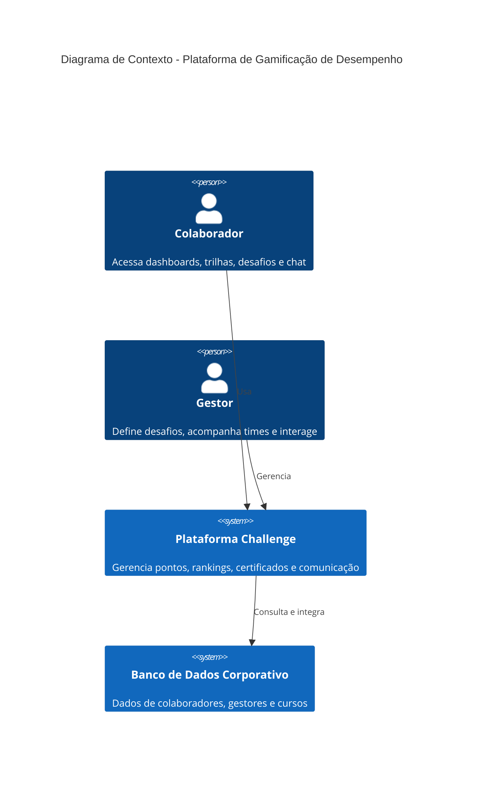
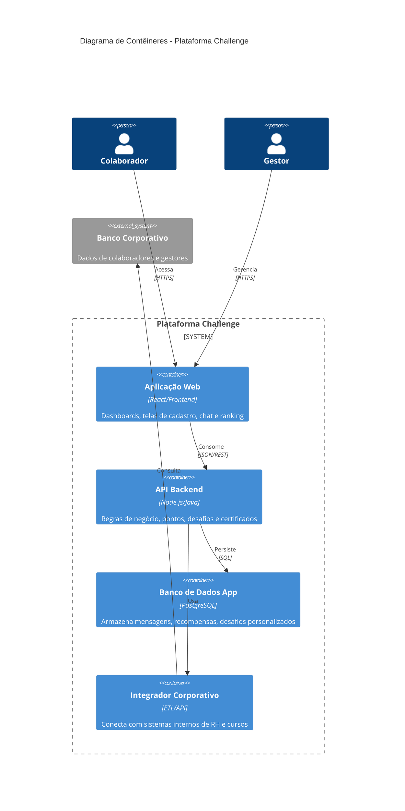
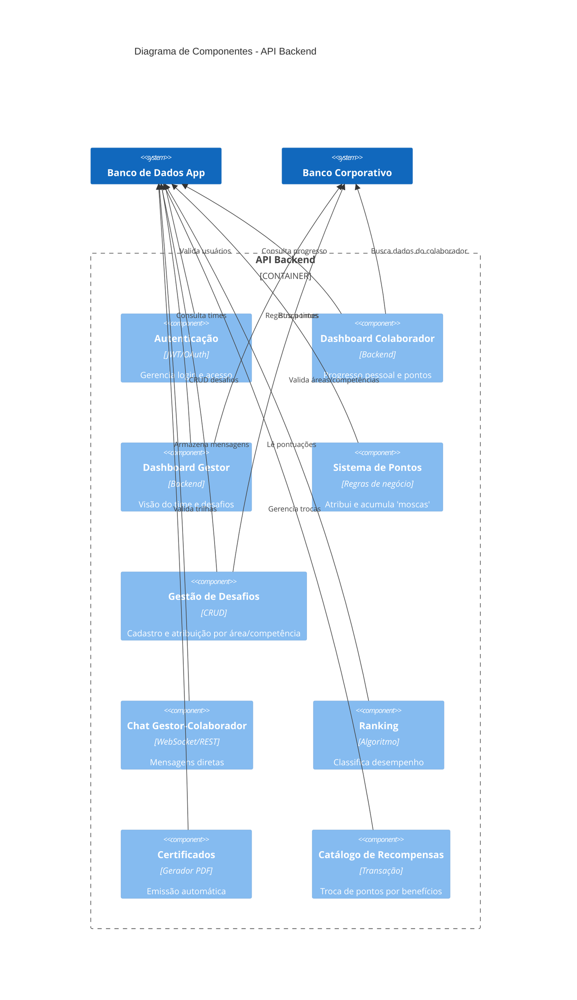

# Eurocertifica

A plataforma tem como objetivo gamificar a gestão de desempenho e aprendizado de colaboradores, permitindo que gestores acompanhem times, atribuam desafios e recompensas, e que colaboradores acompanhem seu progresso, participem de trilhas e troquem pontos por benefícios.

## Estrutura

- `lib/core`: tema e elementos transversais.
- `lib/features/learning/domain`: entidades, contratos e casos de uso.
- `lib/features/learning/data`: seed de cursos, modelos JSON e persistência local.
- `lib/features/learning/presentation`: controlador, telas e widgets.

## Rodar

```bash
flutter pub get
flutter run -d chrome
```

## Validar

```bash
flutter analyze
flutter test
```

## Documentação de Arquitetura (C4)

Este documento descreve a arquitetura da solução utilizando o modelo **C4 (Contexto, Contêineres e Componentes)**.

Os diagramas são renderizados utilizando a sintaxe **Mermaid**. Você pode visualizá-los em qualquer ferramenta compatível (GitHub, GitLab, Obsidian, ou o [Mermaid Live Editor](https://mermaid.live/)).

---

### 📍 Nível 1: Diagrama de Contexto (C1)



### 📍 Nível 2: Diagrama de Contêineres (C2)



### 📍 Nível 3: Diagrama de Componentes (C3) – Backend Principal


