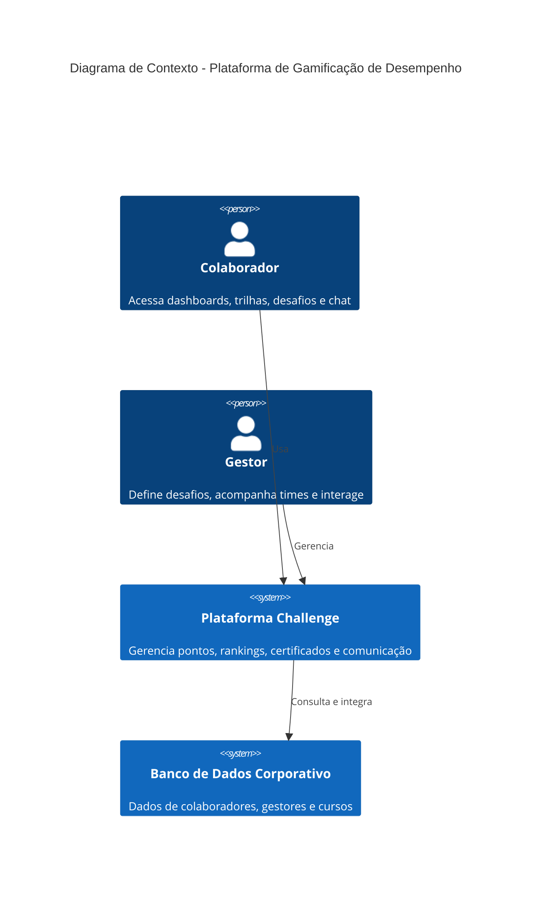
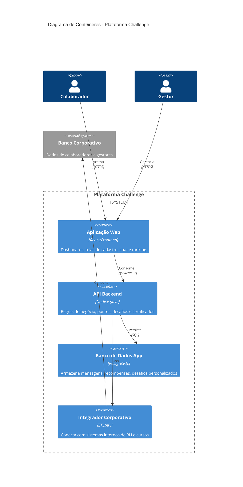
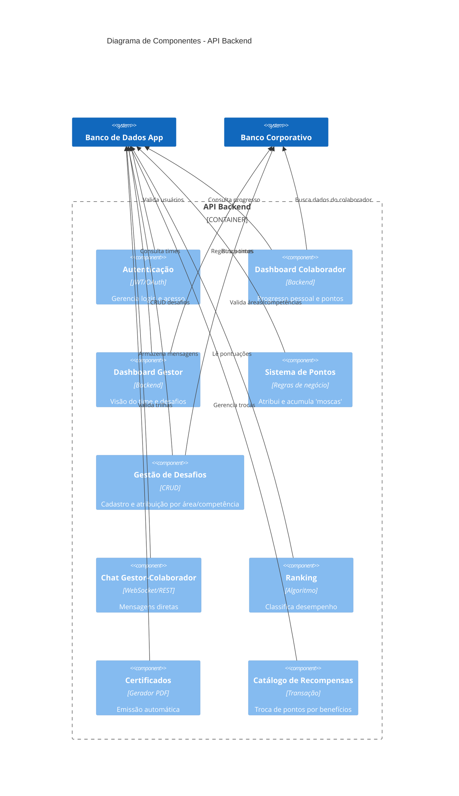

# Eurocertifica

A plataforma tem como objetivo gamificar a gestão de desempenho e aprendizado de colaboradores, permitindo que gestores acompanhem times, atribuam desafios e recompensas, e que colaboradores acompanhem seu progresso, participem de trilhas e troquem pontos por benefícios.

## Estrutura

- `lib/core`: tema e elementos transversais.
- `lib/features/learning/domain`: entidades, contratos e casos de uso.
- `lib/features/learning/data`: seed de cursos, modelos JSON e persistência local.
- `lib/features/learning/presentation`: controlador, telas e widgets.

## Rodar

```bash
flutter pub get
flutter run -d chrome
```

## Validar

```bash
flutter analyze
flutter test
```

## 📚 Documentação de API

A documentação da API está em `doc/swagger/api-docs.yaml` no formato OpenAPI 3.0.

Para visualizar interativamente:
- **Swagger UI:** [https://editor.swagger.io](https://editor.swagger.io) (cole o conteúdo do arquivo)

## Documentação de Arquitetura (C4)

Este documento descreve a arquitetura da solução utilizando o modelo **C4 (Contexto, Contêineres e Componentes)**.

Os diagramas são renderizados utilizando a sintaxe **Mermaid**. Você pode visualizá-los em qualquer ferramenta compatível (GitHub, GitLab, Obsidian, ou o [Mermaid Live Editor](https://mermaid.live/)).

---

### 📍 Nível 1: Diagrama de Contexto (C1)



### 📍 Nível 2: Diagrama de Contêineres (C2)



### 📍 Nível 3: Diagrama de Componentes (C3) – Backend Principal


## Casos de Uso Principais

### 🧑‍💼 Onboarding
Novo colaborador completa a trilha inicial de integração e ganha sua primeira badge de "Iniciante".

---

### 🧪 Treinamento de SOP
Colaborador realiza desafio interativo sobre novo procedimento operacional padrão (SOP) da ANVISA.

---

### 📢 Intervenção do Gestor
Gestor identifica colaborador inativo há 7 dias e envia uma missão motivacional personalizada.

---

### 🏆 Resgate de Prêmio
Colaborador troca "moscas" acumuladas por uma caneca personalizada ou vale-presente no catálogo.

## 🧪 Testes

### 📋 Estrutura de Testes

Os testes estão organizados seguindo a estrutura de features:

```
test/
├── widget_test.dart
└── features/
    └── auth/
        ├── domain/
        │   ├── entities/
        │   │   └── user_entity_test.dart
        │   └── usecases/
        │       └── login_usecase_test.dart
        ├── data/
        │   ├── models/
        │   │   └── user_model_test.dart
        │   ├── repositories/
        │   │   └── auth_repository_impl_test.dart
        │   └── datasources/
        │       └── auth_remote_datasource_test.dart
        └── integration/
            ├── auth_integration_test.dart
            └── integration_end_to_end_test.dart
```

### 🚀 Executar Testes

#### 1️⃣ **Todos os testes**
```bash
flutter test
```

#### 2️⃣ **Apenas testes de uma feature**
```bash
flutter test test/features/auth/
```

#### 3️⃣ **Apenas testes de um tipo específico**

**Testes unitários:**
```bash
flutter test test/features/auth/domain/ test/features/auth/data/
```

**Testes de integração:**
```bash
flutter test test/features/auth/integration/
```

#### 4️⃣ **Um arquivo de teste específico**
```bash
flutter test test/features/auth/domain/usecases/login_usecase_test.dart
```

#### 5️⃣ **Com modo verbose (detalhado)**
```bash
flutter test -v
```

#### 6️⃣ **Com cobertura de código**
```bash
flutter test --coverage
```

Para analisar a cobertura após executar:
```bash
# Windows
lcov --list coverage/lcov.info

# macOS/Linux
lcov -l coverage/lcov.info
```

#### 7️⃣ **Com cobertura de uma feature específica**
```bash
flutter test test/features/auth/ --coverage
```

#### 8️⃣ **Parar na primeira falha**
```bash
flutter test --fail-fast
```

#### 9️⃣ **Executar apenas testes que contêm uma palavra-chave**
```bash
flutter test -k "login"
```

#### 🔟 **Gerar mocks (se necessário)**
```bash
flutter pub run build_runner build
```

### 📊 Resumo de Testes Disponíveis

| Camada | Arquivo | Tipo | Testes |
|--------|---------|------|--------|
| Domain | `login_usecase_test.dart` | Unitário | 1 |
| Data | `user_model_test.dart` | Unitário | 3 |
| Data | `auth_repository_impl_test.dart` | Unitário | 1 |
| Data | `auth_remote_datasource_test.dart` | Unitário | 2 |
| Integration | `auth_integration_test.dart` | Integração | 2 |
| Integration | `integration_end_to_end_test.dart` | Integração | 1 |
| **Total** | - | - | **11** |

### 🎯 Verificações Implementadas

- ✅ Factories de entidades
- ✅ Igualdade de objetos
- ✅ Serialização/Desserialização
- ✅ Mocking de dependências
- ✅ Testes de exceção
- ✅ Testes de rede
- ✅ Validações de entrada
- ✅ Fluxo completo end-to-end

### 📦 Dependências de Teste

```yaml
dependencies:
  flutter_test:
    sdk: flutter
  mockito: ^5.4.0
  build_runner: ^2.4.0
```

### 💡 Dicas Úteis

- **Rodar testes em modo watch:** Use uma extensão de IDE ou execute múltiplas vezes
- **Melhorar performance:** Execute testes de uma feature por vez
- **CI/CD:** Configure pipelines para rodar `flutter test --coverage` automaticamente
- **Cobertura ideal:** Mantenha acima de 85% no total do projeto
